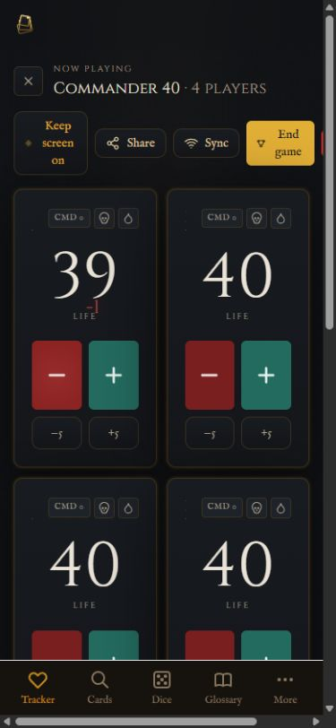
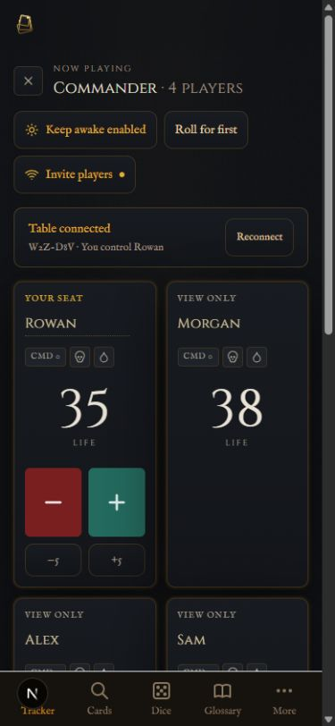

# TheStack.gg audit and improvement delivery

**13 September 2026 · branch `codex/table-reliability-audit` · based on `14861a8`**

The site has a strong dark-and-gold identity and a useful collection of table tools. Its weakest point was continuity: a player could lose their place, see stale totals, or have a retry silently discarded. This delivery prioritizes that trust, then improves the dice experience, mobile usability, search, and teaching accuracy.

The live site was inspected at [thestack.gg](https://www.thestack.gg). Changes were implemented and verified locally. **Production has not been deployed.**

## What changed

| Priority | Finding and evidence | Delivered improvement |
| --- | --- | --- |
| Critical | The installed Next 14.2.22 dependency tree had 20 production advisory findings, including one critical. | Next 15.5.25, maintained PWA tooling, compatible transitive patches. Full and production npm audits now report zero known vulnerabilities. |
| High | Reloading the live tracker returned to setup. Seat/session recovery was incomplete after suspension. | Save local tables, remember shared sessions and seats, resume automatically, fetch current totals, and provide explicit recovery/error actions. |
| High | Operation IDs restarted after reload, causing new edits to look like duplicate old edits. Unacknowledged edits could be lost. | Unique operation IDs; persist an ordered outbox before sending; retry the same operation until acknowledged; reconnect on visibility, focus, pageshow, and network return. |
| High | Concurrent Redis read-modify-write operations overwrote each other; simultaneous seat claims could both succeed. | Atomic Lua compare-and-swap commits with bounded, jittered retries; shared atomic seat claims and releases. A real Redis test preserved all 60 edits from six concurrent writers. |
| High | Polls beyond retained history lacked complete catch-up; old retries could apply again after history rollover. | Full snapshot recovery for history gaps; separate operation receipts retained for the session lifetime; seat changes included in polls. |
| High | Public session/history responses exposed device IDs used as write credentials. | Return only the requesting device's own identity; project other owner/author identities and legacy operation IDs to opaque values. |
| High | A service worker could cache API state. | All `/api/` traffic is NetworkOnly; explicit no-store sync responses and a new cache version. |
| Medium | Live mobile tracker controls overflowed horizontally and player names collapsed. | Wrapping toolbar, visible names/ownership, responsive life totals, connection/outbox status, larger counter controls, accessible dialogs and reset/exit confirmations. |
| Medium | Wake-lock state could incorrectly remain enabled after release. | Separate desired/actual wake state, reacquire after visibility return, handle unsupported devices and cleanup races. |
| Medium | A failed final sync could create duplicate recaps on retry, or recreate an ended local save. | Cache the successful recap through modal retries; lock its metadata; await end-game acknowledgment; clear local state before navigating. |
| Medium | Searching the live card tool for “Sol Ring” displayed “Solemn Offering.” Old requests could overwrite newer searches. | Prefer exact card names; cancel/ignore stale search, autocomplete and pagination results; search immediately when selecting a suggestion. |
| Medium | Token and glossary links included a card query that the destination ignored. | Card Lookup now consumes linked queries, searches on arrival and responds when the query changes. |
| Medium | Rules loading could become permanently stuck after a failure or search an old query; long result lists buried the selected rule on mobile. | Retryable, coalesced loading and latest-query evaluation; labelled search controls, bounded result scrolling and compact previews. |
| Medium | The live Stack demo displayed the first spell above the last response and cleared spells at the wrong step. | Correct LIFO ordering and resolution, a manual Next step control, clickable steps, corrected priority wording and reduced-motion behavior. |
| Medium | The dice tool lacked the requested tactile presentation and a table-wide starting-player decision. | Real numbered 3D dice, shaded resin and metallic accents, felt tray, soft shadows, tumbling/bouncing motion, d100 percentile pairs, plus saved group d20 roll-offs. |
| Low | Small filters, missing selected-state announcements, misleading “coming soon” sync copy and dead social links reduced clarity. | Larger glossary/token filters, live result counts, selected states, working navigation, accurate homepage copy, keyboard focus handling, zoom support and storage-tolerant theme controls. |

## Dice experience

- Roll d4, d6, d8, d10, d12, d20 or d100, or build a pool of up to eight dice.
- The rendered upper face matches the announced result. Percentile rolls use tens and units dice; 00 + 0 means 100.
- **Who goes first?** accepts 2–8 names, rolls a d20 per player, picks the highest result and rerolls only tied leaders. Original player colors stay consistent during tie-breaks.
- **Roll for first** in the tracker imports the current table's names. Results and round history survive reloads.
- Tapping a roll brings the tray into view on phones, keeping the animation and final result visible. Reduced-motion users get an immediate scroll and settled result.
- This group function rolls together on **one device**. It does not coordinate separate roll buttons on each player's phone.
- Motion is choreographed around a random result; this is not a rigid-body physics simulation. Reduced motion settles immediately. A readable fallback remains available without WebGL.
- The 3D engine loads only on the dice surface, caps rendering resolution and stops its animation loop at rest. The production route's initial first-load JS is 115 kB; the 3D engine is a separate lazy-loaded chunk.

## Visual evidence

The narrow viewport was 390 × 844 CSS pixels. The tracker measured 375 px content width and 375 px scroll width after the fix, with the remaining width used by the browser scrollbar.

| Before: live tracker | After: local tracker |
| --- | --- |
|  |  |

Additional evidence: [live homepage](live-home.png), [live card mismatch](live-cards-mobile.png), [corrected card result](cards-mobile-after.png), [live Stack order](live-stack-mobile.png), [manual Stack steps](stack-mobile-after.png), [live dice](live-dice-mobile.png), [new percentile dice](dice-percentile-mobile.png), [new group roll](dice-group-mobile.png).

## Verification

- `npm test -- --runInBand`: **715 passed**, 3 opt-in Redis tests skipped in the ordinary run; 72 suites passed.
- The three opt-in real Redis integration tests passed separately against Redis 7, including six-device writes/seat contention, deduplication and TTL checks. The temporary container was removed afterward.
- `node scripts/test-dice-geometry.mjs`: **6 passed**, testing each real polyhedron and every landing face.
- `npm run build`: passed with Next 15.5.25, including TypeScript checking and service-worker generation.
- `npm run lint`: passed; existing raw-image optimization warnings remain. No lint rule or type checking was disabled.
- `npm audit` and `npm audit --omit=dev`: **0 vulnerabilities** at the time of this audit.
- Generated service worker verified to register `/api/` with NetworkOnly.
- Two separate browser origins joined the same local table as different players. Rowan changed 40→35; Morgan changed 40→39; both screens showed 35/39. Morgan reloaded `/tracker` without a join query, returned automatically to the same seat, changed 39→38, and both screens converged on 35/38.
- Browser checks verified genuine 3D rendering, d20 animation, d100's two physical dice, a highest-d20 winner, imported names and persistent group results. Tie logic, corrupted storage, rapid clicks, offline retries, response-loss retries, rejected operations and wake events also have automated coverage.
- After the final mobile scroll adjustment, all 14 dice UI tests passed again. The browser measured the tray at 80.5–400.5 px within an 844 px viewport after rolling, with the winner visible below it.
- Production-browser checks confirmed exact Sol Ring results, token filtering (Treasure), selectable Stack steps, and Escape closing the mobile menu and restoring focus to its trigger. Inspected production pages had no captured console errors.

## Remaining limits and follow-up work

1. **Physical-device acceptance:** test Safari and installed iPhone PWA after a real screen lock, app switch, network change and browser process eviction. Desktop browser reload/lifecycle tests do not establish iOS suspension behavior. Wake Lock also depends on browser and secure-context support.
2. **Recap history:** synchronized totals are authoritative; the recap still records locally observed events. Long catch-up gaps, batched remote changes and rejected optimistic edits can make historical event details incomplete or inaccurate. The end-game UI now discloses this. A future server-generated recap should derive its history from accepted operations and explicit checkpoints.
3. **Finalization across reload:** a successfully saved recap ID is cached while the end-game modal remains mounted. Reloading during final sync preserves the queued end operation but can lose that navigation receipt. Persisting an idempotent recap receipt is a further improvement.
4. **Existing open clients:** deployment must be followed by a reload of existing devices so they send the new identity header. Previously exposed device credentials cannot be retroactively revoked by response masking. Existing operations removed before this update cannot acquire missing receipts retroactively.
5. **Session lifetime:** shared tables remain valid for 24 hours from creation. Cross-device identity migration, accounts, long-term session renewal and a rate-limiting redesign are outside this delivery.
6. **Performance:** idle rendering and loading behavior were inspected, but no field Core Web Vitals or physical low-end-phone frame-rate measurements were collected. Existing image optimization warnings remain an opportunity.

## Preview and engineering handoff

- Production build preview: `http://localhost:3228/dice`.
- Development preview: `http://localhost:3227`.
- Start development: `npm run dev -- -p 3227 -H 0.0.0.0`.
- Rebuild and start production: `npm run build`, then `npm run start -- -p 3228 -H 0.0.0.0`.
- A configured Redis connection is required on Vercel; local in-memory fallback is process-wide and survives hot reload, but not a server restart.
- Detailed reviews: [sync server](../sync-server-review.md), [dependency security](../dependency-security-review.md), [dice and search](../dice-and-search.md), [tooling and shell](../tooling-shell-audit.md).

Teaching copy was checked against the [official Magic rules](https://magic.wizards.com/en/rules). Dependency rationale and primary advisories are linked in the security review. No production games, credentials or deployments were modified.
